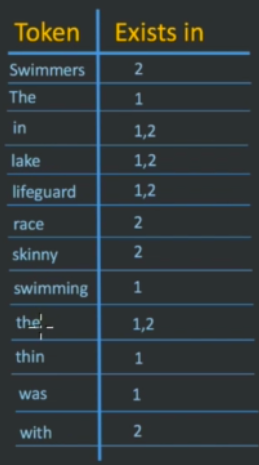
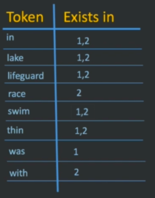

# Structure:
* In elastic instead of table we have *index*.
* Instead of rows we have *documents*.
* Instead of columns we have *Fields*.
* We have : `Index > Type > Document > Field` .
* For each Index we have just One Type and for each type we have multiple Documents and for each Documents we have multiples Fields.
* In elastic instead of saying inserting data it would called indexing.
* Analysis is indexing and retrieve index process which are text.
* `Important`: By default elasticsearch would behave like dynamic document you can add more field to document after you specify mapping but you can change this structure, you can set dynamic to `false`(indexing field will be ignore) or `strict`(indexing new filed will throw error):
```
GET {index}/_mapping
{
    "dynamic":false(or true(this is default value) or strict)
}
```

# Analysis:
* This process are for both search(querying or retrieving) and indexing.
* This process includes two steps: 1.Tokenizer 2.Filer
* Steps are includes:

    1.Tokenizer:take documents and convert it to inverted index for example

    * this two document indexing:
         * The thin lifeguard was swimming in the lake
         * Swimmers race with the skinny lifeguard in lake
         * inverted index would be like this in tokenizer step:
  



    2.Filter:The second step would be remove Stop words suck as "the".
    
    3.Filter:The third step would be convert all of them to Lowercase character.
    
    4.Filter:Next step is Stemming for example turn this word "swimming" to "swim" 
    
    5.Filter:Next step is turn Synonyms to once for example "skinny" and "thin"
* And At the end after filter step it would be like this:


    
* We can check all analyzer for see how it works and analyze data and filter and tokenizer by this codes:
```
GET _analyze
{
  "analyzer": "{type of analyzer}",
  "text":"{text for analyze}"
}
```
### All kind of analyzer:
1. Standard Analyzer
2. Simple Analyzer
3. Whitespace Analyzer
4. Stop Analyzer
5. Keyword Analyzer
6. Pattern Analyzer
7. Language Analyzers
8. Fingerprint Analyzer
9. Custom Analyzer

#### Custom Analyzer:
```
PUT /{index}
{
  "settings": {
    "analysis": {
      "filter": {
        "arabic_stop{field for filter}": {
          "type":       "stop",
          "stopwords":  "_arabic_" 
        },
        "arabic_keywords{field for filter}": {
          "type":       "keyword_marker",
          "keywords":   ["مثال"] 
        },
        "arabic_stemmer{field for filter}": {
          "type":       "stemmer",
          "language":   "arabic"
        }
      },
      "analyzer": {
        "rebuilt_arabic{this is name of analyzer}": {
          "tokenizer":  "standard{type of token making}",
          "filter": [  // this is filter steps
            "lowercase",
            "decimal_digit",
            "arabic_stop",
            "arabic_normalization",
            "arabic_keywords",
            "arabic_stemmer"
          ]
        }
      }
    }
  }
  "mappings":{
    "my_type":{
      "properties":{
        "my_text":{
          "type":"text",
          "analyzer":"rebuilt_arabic"
        }
      }
    }
  }
}
```

### for test custom analyzer:
```
GET /{index}/_analyze
{
    "analyzer":"rebuilt_arabic",
    "text":" هل ه‌ذه ماذا"
}
```

# INDEX:
* Indexes have just 3 sections:
  
   * aliases: 
   * mappings: model of data
   * settings: number of shards and replicas


# Commands:
```
(PUT/POST/GET/DELETE) /{index}/{type}/{id}/({filed})
{
    "field1": "value1",
    "field2": "value2",
    ...
}
```

## GET: 

### Examples:

1. get all a data specific by one id and also you can filter it by name
```
GET /{index}/{type}/{id}/({filed})
```

2. search inside index or type
```
GET /{index}/{type}/_search
```
or
```
GET /{index}/_search
```
it would return object inside this object all of data is inside hits.hits by array

2. get data by `term`
```
GET /{index}/({type}/)_search
{
    "query" : {
        "term":{
            "{key}":"{value}"
        }
    }
}
```

3. get data by `match_all`
```
GET /{index}/({type}/)_search
{
    "query" : {
        "match_all":{}
    }
}
```
### Search DSL Components:
* Query Context:
  
1. match_all: basic query this would return every thing.example:
  ```

  GET /{index}/({type}/)_search
  {
      "query" : {
          "match_all":{}
      }
  }

  ```
2. match: specific filed, example:
  ```

  GET /{index}/({type}/)_search
  {
      "query" : {
          "match":{"name(key)":"computer(value)"}
      }
  }

  ```
  * this query would return which document whom contain computer word
  
3. exists: this query would specify document which contain this field even if that field value of it is empty
  ```

  GET /{index}/({type}/)_search
  {
      "query" : {
          "exists":{"name(key)":"computer.NestedKeyName(key)"}
      }
  }

  ```
   
4. must: complected query. you can combine multiple query on this
  ```

  GET /{index}/({type}/)_search
  {
      "query" : {
          "bool":{
            "must":[
              {"match(match_phrase,multi_match,range)":{"name(key)":"computer(value)"}},
              {"match":{"room(key)":"c8(value)"}}
            ]
          }
      }
  }

  ```
5. must_not: complected query. you can combine multiple query on this
  ```

  GET /{index}/({type}/)_search
  {
      "query" : {
          "bool":{
            "must":[
              {"match(match_phrase,multi_match,range)":{"name(key)":"computer(value)"}},
              {"match":{"room(key)":"c8(value)"}}
            ],
            "must_not":[
              {"match(match_phrase,multi_match,range)":{"professor.name(key)":"bill(value)"}},
              {"match":{"professor.family(key)":"smit(value)"}}
            ]
          }
      }
  }

  ```
6. should: means it would nice to have it is like it always it would ignore by elastic search ,unless you would specify minimum_should_match : for example one (minimum_should_match:1 it means at least one of condition should be match)
  ```

  GET /{index}/({type}/)_search
  {
      "query" : {
          "bool":{
            "must":[
              {"match(match_phrase,multi_match,range)":{"name(key)":"computer(value)"}},
              {"match(match_phrase,multi_match,range)":{"room(key)":"c8(value)"}}
            ],
            "must_not":[
              {"match(match_phrase,multi_match,range)":{"professor.name(key)":"bill(value)"}},
              {"match(match_phrase,multi_match,range)":{"professor.family(key)":"smit(value)"}}
            ],
            "should":[
              {"match(or every kind of query (match_phrase,multi_match,range))":{"professor.locate(key)":"German(value)"}},
              {"match(match_phrase,multi_match,range)":{"professor.locate(key)":"Iraq(value)"}}
            ],
            "minimum_should_match":1(number of should )
          }
      }
  }

  ```
7. multi_match: when you have couple field and wanna search just one word or phrase on both on it you should use multi_match:
  ```

  GET /{index}/({type}/)_search
  {
      "query" : {
          "multi_match":{
            "fields":["name(key)","professor.department(key)"],
            "query":"accounting(word or phrase)"
          }
      }
  }

  ```
8. match_phrase: this one would match part of sentence.with exact tokens
  ```

  GET /{index}/({type}/)_search
  {
      "query" : {
          "match_phrase":{
            "course_description(key)":"this is course description(phrase)"
          }
      }
  }

  ```
9. match_phrase_prefix: this one would match part of sentence.
   
  ```

  GET /{index}/({type}/)_search
  {
      "query" : {
          "match_phrase_prefix":{
            "course_description(key)":"this is course desc(phrase)"
          }
      }
  }

  ```
10. range:  search for range of number or date.
  ```

  GET /{index}/({type}/)_search
  {
      "query" : {
          "range":{
            "students_enrolled(key)":{
              "gt(or gte)":19(number that you wanna say it would grater than),
              "lt(or lte)":30(number that you wanna say it would less than)
            }
          }
      }
  }

  ```
    

* Filter Context:


## PUT:
* For `updating you can create` document with this command and update 
* For each time you would update one document in background elastic would remove and create your document again

1. create or update index or document or type
```
PUT /{index}/{type}/{id}
{
    "field1": "value1",
    "field2": "value2",
    ...
}
```

## POST:
* For `update and for create` would be used 


## DELETE:
* For `delete` would be used 
* You can delete documents
* You can delete types
* You can delete indices